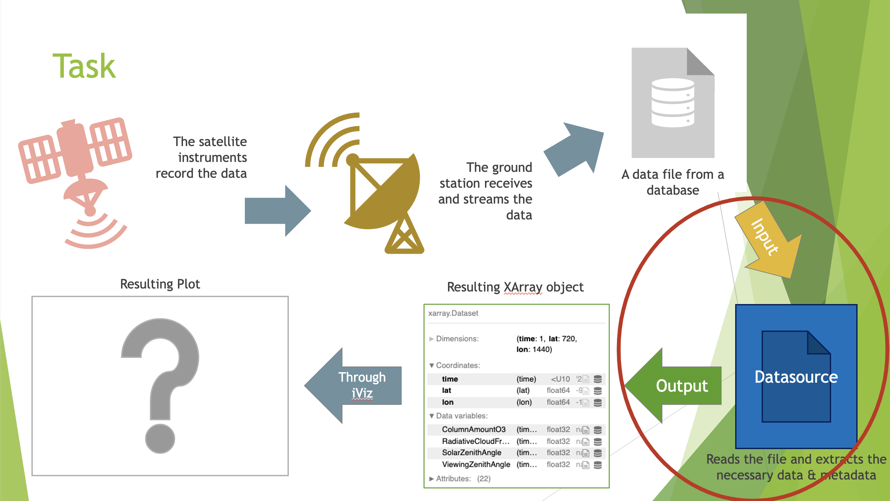

# EViz: Easy Visualization of Earth-systems Models
### About
This repository showcases my work during the summer of 2022 on EViz during my internship with Science Systems and Applications, Inc. as a Software Developer Engineer. The three main portions of the repository are my [presentation](./EViz_Prez.pdf), the [code](./eviz/) I developed, and the Jupyter Notebook tutorials I created.

I was part of the [Advanced Software Technology Group](https://astg.pages.smce.nasa.gov/website/) (ASTG), a subdivision of the [NASA Center for Climate Solutions](https://www.nccs.nasa.gov) (NCCS) at NASA Goddard Space Flight Center.

&nbsp;&nbsp;&nbsp;&nbsp;&nbsp;&nbsp;&nbsp;&nbsp;&nbsp;&nbsp;&nbsp;&nbsp;&nbsp;&nbsp;&nbsp;&nbsp;&nbsp;&nbsp;&nbsp;&nbsp;&nbsp;&nbsp;&nbsp;&nbsp;&nbsp;&nbsp;&nbsp;&nbsp;&nbsp;&nbsp;&nbsp;&nbsp;&nbsp;&nbsp;&nbsp;&nbsp;&nbsp;&nbsp;&nbsp;&nbsp;&nbsp;&nbsp;&nbsp;&nbsp;&nbsp;&nbsp;&nbsp;&nbsp;&nbsp;&nbsp;&nbsp;&nbsp;&nbsp;&nbsp;&nbsp;&nbsp;&nbsp;&nbsp;&nbsp;&nbsp;&nbsp;&nbsp;&nbsp;&nbsp;&nbsp;&nbsp;&nbsp;&nbsp;&nbsp;&nbsp;&nbsp;&nbsp;

For more information about EViz, visit ASTG's website [here](https://astg.pages.smce.nasa.gov/website/research/#easy%20visualization%20of%20earth%20system%20models) and EViz's documentation website [here](https://astg.pages.smce.nasa.gov/visualization/eviz/index.html).

---
### Project Objective
EViz consists of two tools:
* eViz: A command-line input plotting tool configurable by YAML files
* iViz: An interactive visualization tool that gives clients greater freedom to explore data

The objective of my internship was to expand EViz (iViz in particular), to read satellite data as at the time, it had only been developed to handle Earth-systems model data.

iViz had already been developed to handle the visualization process past the point of transforming data files into a Python `XArray` object. Thus, my objective was to process satellite data into an `XArray` object to then pass along to the main `iviz.py` file. This was accomplished by the creation of a `Datasource` class and several other files that would handle all of this.

---
### 
Severall satellites process information in databases in Hierarchical Data Format (HDF) and while the exact organization of data may vary, they can be extracted similarly using Python.

Two satellites of focus for this project were Landsat 5 and the Ozone Monitoring Instrument (OMI). The file format Landsat 5 is HDF Version 4 (HDF4) and the Python module `PyHDF` is what I used to read files. The OMI uses HDF Version 5 (HDF5) and the Python module `H5py` is what I used.

There were three stages of refining this process:
1. Creating Jupyter notebooks to explore reading files
   * See the notebook for reading Landsat 5 data [here](./eviz/)
   * See the notebook for reading OMI data [here]()
2. Writing preliminary Python files that contain functions that perform the data transformation into `XArray` datatypes based on Jupyter notebook findings
   * See the preliminary file for Landsat 5 [here]()
   * See the preliminary file for OMI [here]()
3. Final implementation of Python files to be imported and used in the `Datasource` class in `datasource.py`
   * See the final implementation for reading Landsat 5 data [here]()
   * See the final implementation for reading OMI data [here]()
